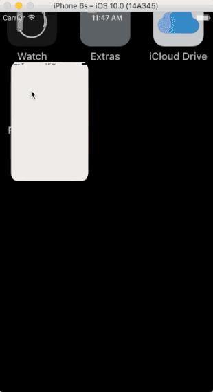

# FakeNews

This app is an imitation of [NetEase News(网易新闻)](https://itunes.apple.com/cn/app/wang-yi-xin-wen-zui-you-tai/id425349261?l=en&mt=8).I wrote this project, which is inspired by [SXNews](https://github.com/dsxNiubility/SXNews), for learning iOS Development purpose. All Swift code here are basically translated from the original Objective-C code. So, the quality of code is not very good, and there are certainly many bugs. I'm sorry for that.

I'll keep maintaining this project. The code will be regularly rewrote in a Swifty way, and the dependency of all the Objective-C libraries will be changed into pure Swift libraries, for the purpose of the elimination of ugly type casting in the code and improvement of code quality.

## Features

1. An Advertisment can be presented at loding time.The Picture will be different according the the timestamp.
	
	
	
2. Both overall and detail weather condition of Beijing can be presented.

	
	
3. News can be presented in different ways.

	
	
4. News can be searched by key words.

	
	
5. Comments, both the hottest and the lastest, will be showned.

	
	
6. Rich UI/UX details are implemented.

	
	
## Requirements

1. Xcode 8.0
2. Swift 3.0	
	
## How to Compile this project

1. cd to the Folder of FakeNews
2. run `Pod install`
3. open the FakeNews.wcworkspace

Then, everything should work fine.

